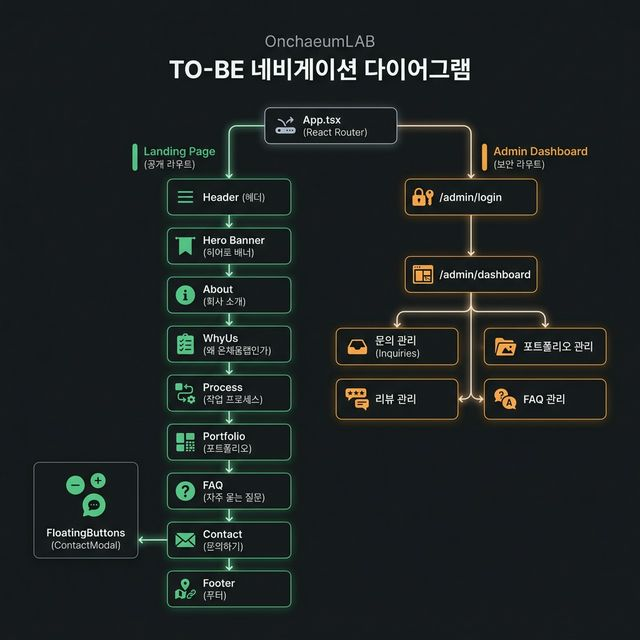

# 🏗️ 온채움랩 (OnchaeumLAB) — 프로젝트 구조 설계서

> **최종 업데이트:** 2026-03-26  
> **기준:** 현재 프론트엔드 + 백엔드(Supabase) 고도화 목표 기반 설계

---

## 📌 1. 현재 프로젝트 구조 (AS-IS)

```
onchaeumlab/
├── index.html                        ← 진입점 HTML
├── package.json                      ← 의존성 관리 (Vite + React + TypeScript)
├── vite.config.ts                    ← Vite + TailwindCSS 설정
├── tsconfig.json                     ← TypeScript 설정
├── .env.example                      ← 환경변수 예시 (GEMINI_API_KEY)
├── .gitignore
├── README.md
├── metadata.json
├── fetch.ts                          ← ⚠️ 루트에 있는 유틸 (위치 부적절)
│
├── public/                           ← 정적 에셋 (이미지)
│   ├── cube-logo.png
│   └── cube-mainbg.jpg
│
├── app/
│   └── applet/                       ← AI Studio 관련 (미사용)
│
└── src/
    ├── main.tsx                      ← React 루트 렌더링
    ├── index.css                     ← TailwindCSS 기본 설정
    ├── fetch.ts                      ← ⚠️ 중복 파일
    ├── App.tsx                       ← ⚠️ 라우터 없이 모든 컴포넌트를 직접 렌더링
    │
    ├── data/
    │   └── portfolio.ts              ← ⚠️ 포트폴리오만 분리, 나머지는 컴포넌트 내 하드코딩
    │
    └── components/                   ← ⚠️ 13개 파일이 분류 없이 한 폴더에 혼재
        ├── Header.tsx                  (162줄)  네비게이션 + 모바일 메뉴
        ├── Hero.tsx                    (102줄)  히어로 배너
        ├── About.tsx                   (176줄)  회사소개 카드 캐러셀
        ├── WhyUs.tsx                   (188줄)  차별점 소개
        ├── Process.tsx                 (146줄)  제작 프로세스 5단계
        ├── Portfolio.tsx               (153줄)  포트폴리오 + 필터 + 모달
        ├── Reviews.tsx                 (341줄)  ⚠️ 가장 큰 파일, 리뷰 마키 + 캐러셀
        ├── FAQ.tsx                     (111줄)  아코디언 FAQ
        ├── Contact.tsx                 (160줄)  문의 폼 (DB 미연동)
        ├── ContactModal.tsx            (229줄)  플로팅 버튼 문의 모달
        ├── FloatingButtons.tsx          (77줄)  플로팅 버튼 (채팅/카카오/Go up)
        ├── Footer.tsx                   (51줄)  푸터
        └── Iridescence.tsx             (153줄)  WebGL 이펙트 (미사용)
```

### 현재 구조의 문제점

| 문제 | 설명 |
|------|------|
| 🔴 **폴더 분류 없음** | 13개 컴포넌트가 `components/` 한 폴더에 혼재 |
| 🔴 **라우터 미적용** | `App.tsx`에서 라우터 없이 컴포넌트를 직렬 배치 |
| 🔴 **데이터 하드코딩** | FAQ(4건), Reviews(6건), WhyUs 특징 데이터가 각 컴포넌트 안에 직접 작성 |
| 🟡 **데이터 분리 불일치** | Portfolio만 `data/` 폴더로 분리됨, 나머지는 컴포넌트 내 혼합 |
| 🟡 **중복 파일** | `fetch.ts`가 루트와 `src/` 두 곳에 존재 |
| 🟡 **타입 정의 미분리** | TypeScript 인터페이스가 각 컴포넌트에 인라인으로 정의 |
| 🟡 **관리자 페이지 없음** | 콘텐츠 관리를 위한 Admin 시스템 부재 |
| 🟢 **상태 관리 미구축** | Context/Hook 패턴 없이 컴포넌트 개별 state로만 운영 |

---

## 📂 2. 목표 프로젝트 구조 (TO-BE)


```
onchaeumlab/
├── index.html
├── package.json
├── vite.config.ts
├── tsconfig.json
├── .env.example                      ← Supabase 환경변수 추가
├── .env.local                        ← 실제 환경변수 (gitignore)
├── .gitignore
├── README.md
│
├── public/                           ← 정적 에셋
│   ├── images/                       ← 이미지 에셋 정리
│   │   ├── cube-logo.png
│   │   ├── cube-mainbg.jpg
│   │   ├── logo-black.png
│   │   ├── logo-white.png
│   │   └── hero-bg.jpg
│   └── favicon.ico
│
└── src/
    ├── main.tsx                      ← React 루트 + Router 래핑
    ├── index.css                     ← TailwindCSS + 글로벌 스타일
    │
    ├── App.tsx                       ← 라우트 정의 (/, /admin/*)
    │
    ├── lib/                          ← 외부 서비스 초기화
    │   └── supabase.ts              ← Supabase 클라이언트 인스턴스
    │
    ├── types/                        ← TypeScript 타입 정의
    │   ├── database.types.ts        ← Supabase 자동 생성 타입
    │   ├── inquiry.ts               ← 문의 관련 타입
    │   ├── portfolio.ts             ← 포트폴리오 관련 타입
    │   ├── review.ts                ← 리뷰 관련 타입
    │   └── faq.ts                   ← FAQ 관련 타입
    │
    ├── hooks/                        ← 커스텀 React 훅
    │   ├── useAuth.ts               ← 인증 상태 관리
    │   ├── useInquiries.ts          ← 문의 데이터 CRUD
    │   ├── usePortfolios.ts         ← 포트폴리오 데이터 Fetch
    │   ├── useReviews.ts            ← 리뷰 데이터 Fetch
    │   └── useFAQs.ts              ← FAQ 데이터 Fetch
    │
    ├── contexts/                     ← React Context
    │   └── AuthContext.tsx           ← 관리자 인증 Provider
    │
    ├── pages/                        ← 페이지 단위 컴포넌트
    │   ├── LandingPage.tsx          ← 랜딩 섹션 조합 페이지
    │   └── admin/                   ← 관리자 페이지
    │       ├── LoginPage.tsx        ← 관리자 로그인
    │       ├── DashboardPage.tsx    ← 대시보드 (요약 통계)
    │       ├── InquiriesPage.tsx    ← 문의 내역 관리
    │       ├── PortfoliosPage.tsx   ← 포트폴리오 CRUD
    │       ├── ReviewsPage.tsx      ← 리뷰 CRUD
    │       └── FAQsPage.tsx         ← FAQ CRUD
    │
    ├── components/                   ← 재사용 컴포넌트 (역할별 분류)
    │   │
    │   ├── landing/                  ← 랜딩 페이지 전용 섹션 컴포넌트
    │   │   ├── Header.tsx           ← 네비게이션 바 + 모바일 메뉴
    │   │   ├── Hero.tsx             ← 히어로 배너 + CTA
    │   │   ├── About.tsx            ← 회사소개 카드 캐러셀
    │   │   ├── WhyUs.tsx            ← 차별점 소개 (양쪽 카드 + 로고)
    │   │   ├── Process.tsx          ← 제작 프로세스 5단계
    │   │   ├── Portfolio.tsx        ← 포트폴리오 그리드 + 필터 + 모달
    │   │   ├── Reviews.tsx          ← 고객 리뷰 마키 + 모바일 캐러셀
    │   │   ├── FAQ.tsx              ← 아코디언 FAQ
    │   │   ├── Contact.tsx          ← 문의 폼 (Supabase 연동)
    │   │   └── Footer.tsx           ← 푸터
    │   │
    │   ├── common/                   ← 공통 재사용 컴포넌트
    │   │   ├── ContactModal.tsx     ← 플로팅 문의 모달
    │   │   ├── FloatingButtons.tsx  ← 플로팅 버튼 (채팅/카카오/Go up)
    │   │   ├── SkeletonCard.tsx     ← 스켈레톤 로딩 UI
    │   │   ├── Toast.tsx            ← 토스트 알림 메시지
    │   │   ├── ConfirmModal.tsx     ← 확인/취소 공통 모달
    │   │   └── EmptyState.tsx       ← 데이터 없음 상태 UI
    │   │
    │   ├── admin/                    ← 관리자 전용 컴포넌트
    │   │   ├── AdminLayout.tsx      ← 관리자 레이아웃 (사이드바 + 헤더 + 컨텐츠)
    │   │   ├── AdminSidebar.tsx     ← 사이드바 네비게이션
    │   │   ├── AdminHeader.tsx      ← 관리자 상단 헤더
    │   │   ├── StatsCard.tsx        ← 대시보드 통계 카드
    │   │   ├── DataTable.tsx        ← 범용 데이터 테이블
    │   │   └── FormModal.tsx        ← CRUD 입력 폼 모달
    │   │
    │   └── effects/                  ← 비주얼 이펙트 컴포넌트
    │       └── Iridescence.tsx      ← WebGL 이펙트 (OGL 기반)
    │
    └── utils/                        ← 유틸리티 함수
        ├── validators.ts            ← 폼 유효성 검증 (이메일, 전화번호 등)
        └── formatters.ts           ← 날짜/숫자 포맷 헬퍼
```

---

## 🗺️ 3. 통합 네비게이션 다이어그램 (전체 흐름도)

이 다이어그램은 **전체 라우팅 구조**, **랜딩 페이지의 스크롤 섹션 흐름**, 그리고 **관리자 대시보드의 세부 네비게이션**을 하나로 통합하여 보여줍니다.



*(아래는 기존 전체 네비게이션 통합 흐름도입니다)*


---

## 🔄 4. 컴포넌트 의존성 맵 (현재 → 목표)

![컴포넌트 의존성 맵 (현재 vs 목표)]

---

## 📋 5. 파일별 이동/변경 매핑 테이블

### 🟢 랜딩 컴포넌트

| 현재 경로 | 이동 경로 | 변경 사항 |
|-----------|----------|----------|
| `src/components/Header.tsx` | `src/components/landing/Header.tsx` | 폴더 이동만 |
| `src/components/Hero.tsx` | `src/components/landing/Hero.tsx` | 폴더 이동만 |
| `src/components/About.tsx` | `src/components/landing/About.tsx` | 폴더 이동만 (내부 데이터는 정적 유지) |
| `src/components/WhyUs.tsx` | `src/components/landing/WhyUs.tsx` | 폴더 이동만 (내부 데이터는 정적 유지) |
| `src/components/Process.tsx` | `src/components/landing/Process.tsx` | 폴더 이동만 (내부 데이터는 정적 유지) |
| `src/components/Portfolio.tsx` | `src/components/landing/Portfolio.tsx` | 폴더 이동 + **Supabase 연동** |
| `src/components/Reviews.tsx` | `src/components/landing/Reviews.tsx` | 폴더 이동 + **Supabase 연동** |
| `src/components/FAQ.tsx` | `src/components/landing/FAQ.tsx` | 폴더 이동 + **Supabase 연동** |
| `src/components/Contact.tsx` | `src/components/landing/Contact.tsx` | 폴더 이동 + **Supabase 연동** |
| `src/components/Footer.tsx` | `src/components/landing/Footer.tsx` | 폴더 이동만 |

### 🟡 공통 컴포넌트

| 현재 경로 | 이동 경로 | 변경 사항 |
|-----------|----------|----------|
| `src/components/FloatingButtons.tsx` | `src/components/common/FloatingButtons.tsx` | 폴더 이동만 |
| `src/components/ContactModal.tsx` | `src/components/common/ContactModal.tsx` | 폴더 이동 + **Supabase 연동** |
| `src/components/Iridescence.tsx` | `src/components/effects/Iridescence.tsx` | 폴더 이동만 |

### 🔴 새로 생성할 파일

| 새 파일 경로 | 목적 |
|-------------|------|
| `src/lib/supabase.ts` | Supabase 클라이언트 초기화 |
| `src/types/database.types.ts` | Supabase DB 타입 정의 |
| `src/types/inquiry.ts` | 문의 인터페이스 |
| `src/types/portfolio.ts` | 포트폴리오 인터페이스 |
| `src/types/review.ts` | 리뷰 인터페이스 |
| `src/types/faq.ts` | FAQ 인터페이스 |
| `src/hooks/useAuth.ts` | 인증 훅 |
| `src/hooks/useInquiries.ts` | 문의 데이터 훅 |
| `src/hooks/usePortfolios.ts` | 포트폴리오 데이터 훅 |
| `src/hooks/useReviews.ts` | 리뷰 데이터 훅 |
| `src/hooks/useFAQs.ts` | FAQ 데이터 훅 |
| `src/contexts/AuthContext.tsx` | 인증 Context Provider |
| `src/pages/LandingPage.tsx` | 랜딩 컴포넌트 조합 페이지 |
| `src/pages/admin/LoginPage.tsx` | 관리자 로그인 |
| `src/pages/admin/DashboardPage.tsx` | 관리자 대시보드 |
| `src/pages/admin/InquiriesPage.tsx` | 문의 관리 |
| `src/pages/admin/PortfoliosPage.tsx` | 포트폴리오 관리 |
| `src/pages/admin/ReviewsPage.tsx` | 리뷰 관리 |
| `src/pages/admin/FAQsPage.tsx` | FAQ 관리 |
| `src/components/admin/AdminLayout.tsx` | 관리자 공통 레이아웃 |
| `src/components/admin/AdminSidebar.tsx` | 사이드바 |
| `src/components/admin/AdminHeader.tsx` | 관리자 헤더 |
| `src/components/admin/StatsCard.tsx` | 통계 카드 |
| `src/components/admin/DataTable.tsx` | 범용 테이블 |
| `src/components/admin/FormModal.tsx` | CRUD 입력 폼 모달 |
| `src/components/common/SkeletonCard.tsx` | 로딩 스켈레톤 |
| `src/components/common/Toast.tsx` | 토스트 알림 |
| `src/components/common/ConfirmModal.tsx` | 확인 모달 |
| `src/components/common/EmptyState.tsx` | 비어있는 상태 UI |
| `src/utils/validators.ts` | 유효성 검증 유틸 |
| `src/utils/formatters.ts` | 날짜/숫자 포맷 유틸 |

### 🗑️ 삭제/정리할 파일

| 파일 | 이유 |
|------|------|
| `fetch.ts` (루트) | 중복, 미사용 |
| `src/fetch.ts` | 중복, Supabase 클라이언트로 대체 |
| `src/data/portfolio.ts` | Supabase 연동 후 불필요 |
| `app/applet/` | AI Studio 관련, 프로덕션 불필요 |

---

## 🏷️ 6. 정적 데이터 vs DB 데이터 구분 가이드

| 데이터 | 현재 위치 | 관리 방식 | 이유 |
|--------|----------|----------|------|
| 네비게이션 링크 | `Header.tsx` 내부 배열 | **정적 유지** | 변경 빈도 극히 낮음 |
| 히어로 문구 | `Hero.tsx` 내부 | **정적 유지** | 브랜드 핵심 메시지 |
| About 5가지 원칙 | `About.tsx` 내부 배열 | **정적 유지** | 기업 철학, 변경 빈도 낮음 |
| WhyUs 7가지 장점 | `WhyUs.tsx` 내부 배열 | **정적 유지** | 기업 철학, 변경 빈도 낮음 |
| Process 5단계 | `Process.tsx` 내부 배열 | **정적 유지** | 프로세스 고정 |
| Reviews 지표 카드 | `Reviews.tsx` metrics 배열 | **정적 유지** | 마케팅 수치 |
| Footer 정보 | `Footer.tsx` 내부 | **정적 유지** | 법적 정보 |
| **포트폴리오** | `data/portfolio.ts` | **→ DB 이동** | 수시 추가/삭제 필요 |
| **FAQ** | `FAQ.tsx` 내부 배열 | **→ DB 이동** | 수시 추가/수정 필요 |
| **고객 리뷰** | `Reviews.tsx` 내부 배열 | **→ DB 이동** | 수시 추가/수정 필요 |
| **고객 문의** | 미저장 (데모 alert) | **→ DB 이동** | 핵심 비즈니스 데이터 |
문